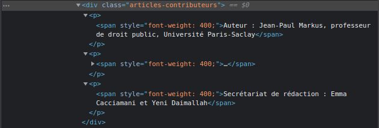

# Documentation

## Arborescence du projet
```text
TER/
│
├── balise.json
├── DOCUMENTATION.md
├── LICENSE
├── main.py
├── README.md
├── requirements.txt
├── resultat_flair.txt
└── src
    ├── database
    │   ├── creation_bdd.py
    │   └── table_bdd.py
    └── extracteur
        ├── extraction.py
        ├── surlignage.py
        └── traitement.py
```

## [balise.json](https://github.com/theophiIe/TER/blob/xpath_version/balise.json)

Fichier qui contient les balises HTML ainsi que les liens `Xpath` permettant de faire le scrapping de données.

Le fichier est découpé en trois catégories : 
 - balise (balises de base utilisées en HTML)
 - class (les classes CSS utilisées dans l'HTML)
 - xpath (les chemins de localisation vers les balises HTML)

Exemple de format pour le fichier :
```json
{
  "balise": {
    "titre" : "//*[@id=\"surlignages\"]/div/div[2]/div[1]/div[2]/h1",
    ...
  },

  "class": {
    "container_article" : "grid-item",
    ...
  },

  "xpath": {
    "titre" : "//*[@id=\"surlignages\"]/div/div[2]/div[1]/div[2]/h1/text()",
    ...
  }
}
```

## [main.py](https://github.com/theophiIe/TER/blob/xpath_version/main.py)

Fichier principal qui permet d'exécuter le projet.

Les différentes actions du programme sont :
 - La récupération des données.
 - Le traitement des données.
 - La création/connexion et le remplissage de la base de données.

## src/database
Dossier contenant les fichiers propres à la base de données.

### [creation_bdd.py](https://github.com/theophiIe/TER/blob/xpath_version/creation_bdd.py)

Fichier qui permet la gestion de la base de données.

Le fichier regroupe de nombreuses fonctions :
 - L'établissement d'une connexion à une base de données de `PostgreSQL`.
 - Les différentes fonctions d'insertions de tuple(auteur, personnalité, source etc..).
 - Les différentes fonctions de remplissage permettent l'ajout de toutes les valeurs d'un élément en utilisant les fonctions d'insertions.

Exemple du fonctionnement de la partie insertion de donnée :
```python
def insert_auteur(session, element, articles) -> None:
    for auteur in articles[element]:
        # Requête permettant l'ajout d'un tuple dans la table Auteur
        q = session.query(Auteur).filter(Auteur.nom == auteur)
        # Le tuple est ajouté s'il n'est pas déjà présent dans la table
        if not session.query(q.exists()).scalar():
            insert(session, Auteur(auteur, None))

def remplissage_auteur(engine, auteurs) -> None:
    # Progress bar dont la taille dépend du nombre d'auteurs
    pbar = tqdm(range(len(auteurs)), colour='green', desc='Remplissage auteur')
    with Session(bind=engine) as session:
        # On effectue une insertion dans la base de donnée pour chaque élément présent dans le tableau
        for element in range(len(auteurs)):
            insert_auteur(session, element, auteurs)
            pbar.update(1)
            pbar.refresh()
```

### [table_bdd.py](https://github.com/theophiIe/TER/blob/xpath_version/table_bdd.py)

Fichier qui regroupe toutes les tables et relations de notre base de données.

Exemple de table :
```python
class Auteur(Base):
    # Nom de la table
    __tablename__ = "t_auteur"

    # Nom des colonnes de la table
    nom = Column(String, primary_key=True)
    profession = Column(String)

    def __init__(self, nom, profession):
        self.nom = nom
        self.profession = profession
```

Exemple de relation :
```python
    # Relation avec la table 'EcritPar'
    parent_ecritpar = relationship("EcritPar", back_populates="child_ecritpar")
```

## src/extracteur
Dossier contenant les fichiers permettant l'extraction et le traitement des données. 

#### Exemple d'un article :


**Légendes :** 

* Violet [Date Création/Date Modification]
* Orange [Auteurs]
* Rouge [Etiquette]
* Vert [Titre]
* Bleu [Source]
* Jaune [Correction]
* Turquoise [Contenue de l'article]
* Fuchsia [Les réferences]
* Noir [Même thème]

### [extraction.py](https://github.com/theophiIe/TER/blob/xpath_version/extraction.py)

Ce fichier contient les fonctions permettant de récupérer le nombre de pages présentes dans une URL, le nombre
d'articles présent sur une page ainsi qu'une fonction faisant appel à toutes les méthodes du fichier `surlignage.py`
permettant la récupération des données.

### [surlignage.py](https://github.com/theophiIe/TER/blob/xpath_version/surlignage.py)

Fichier comprenant la classe principale représentant les articles de type `Surlignage` ainsi que l'ensemble des fonctions
qui permettent d'extraire les éléments qui le compose.

Élements extraits via la méthode utilisant Xpath:
 - les titres des articles.
 - les étiquettes des articles.
 - les urls des articles de même themes.
 - les dates de création et de modification de l'article.
 - les auteurs présents dans l'entête des articles.
 - le nom et l'url de la source sur lesquels se base l'article.
 - la correction des articles.

Élements extraits via la méthode de balises :
 - les urls des articles.
 - les contributeurs de l'article (auteurs, relecteur etc...).
 - le contenu de l'article en question.
 - les références introduites dans le texte de l'article.

La méthode d'extraction via Xpath n'est pas toujours utilisé, car dans certain cas les éléments HTML
diffèrent trop d'un article à l'autre.

Exemple pour la partie contributeur :  
Particularité : possède des balises `span` dans les balises `p`.
  

Particularité : possède des uniquement des balises `p`.


Particularité : la `div articles_contributeurs` est vide.
  

### [traitement.py](https://github.com/theophiIe/TER/blob/xpath_version/traitement.py)

Fichier qui fait appel à la librairie [Flair](https://github.com/theophiIe/TER/blob/xpath_version/traitement.py)
dont l'objectif est de récupérer les différents noms présents dans un texte.

Flair va attribuer des balises aux éléments qui composent le texte. Ainsi, dans notre cas le tag `PER` 
sera la cible pour identifier le nom d'une personnalité, d'un auteur ou encore d'un relecteur.

### [resultat_flair.txt](https://github.com/theophiIe/TER/blob/xpath_version/resultat_flair.txt)

Le fichier `resultat_flair.txt` contient toutes les phrases utilisant `Flair` pour la détection des noms au jour du __29/04/2022 à 22:00__. 

Nous avons utilisé deux méthodes distinctes de calcul pour mesurer la précision d'erreur de `Flair`:
- La première était de considérer comme faux un résultat dès qu'au moins un des résultats renvoyés d'une phrase analysée était faux.
- La seconde avait pour but d'affiner nos résultats. Elle consiste en un système de "score". Pour chaque phrase analysée, on compte le nombre de résultats renvoyés faux et le nombre de résultats renvoyés correct.

Nous avons donc :
- Auteurs : 49/413 string fausse soit __11.86%__ d'erreur pour la première méthode et 52/674 noms faux soit __7.72%__ d'erreur pour la seconde. Les principales erreurs viennent de la reconnaissance du nom `Jules Vernes` qui correspond au nom d'une université,
ainsi que le mot `Deroulez` qui est souvent reconnue.
- Relecteurs : 1/28 string fausse soit __3.57%__ d'erreur pour la première méthode et 1/42 noms faux soit __2.68%__ d'erreur pour la seconde. L'erreur vient du fait qu'il reconnait `Jules Vernes` en tant que nom.
- Secretariat de rédaction : 0/35 string fausse soit __0%__ d'erreur et 0/59 nom faux soit __0%__ d'erreur pour la seconde.
- Personnalités : 15/415 string fausse soit __3.61%__ d'erreur pour la première méthode et 14/399 nom faux soit __3.51%__ d'erreur pour la seconde. Les erreurs provenant de cette partie sont issus de la ponctuation. 
Par exemple, une apostrophe empêche la reconnaissance d'un nom dans les cas comme d'`Emmanuel Macron` ou celui d'`Eric Zemmour`.

Au total, un taux d'erreur de __7.30%__ pour la première méthode et __5.7%__ pour la seconde.
Ces pourcentages sont à même de varier du fait d'ajout constant d'articles sur le site.

